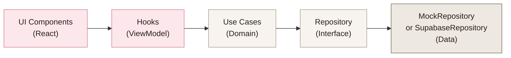

# MyMemory — Architecture & Project Overview

## 🎬 UI Demo Recording


---

## Clean Architecture — Folder Structure

```
src/
├── domain/                    # 🟢 Core Business Logic (ZERO dependencies)
│   ├── entities/
│   │   ├── Photo.ts           # Photo & TimelineGroup interfaces
│   │   ├── Album.ts           # Album interface
│   │   └── index.ts
│   ├── repositories/          # Interfaces (contracts)
│   │   ├── PhotoRepository.ts
│   │   ├── AlbumRepository.ts
│   │   └── index.ts
│   └── usecases/              # Business rules
│       ├── GetTimelinePhotos.ts
│       ├── UploadNewPhoto.ts
│       ├── CreateAlbum.ts
│       └── index.ts
│
├── data/                      # 🔵 Infrastructure & Data Access
│   ├── dto/
│   │   ├── PhotoDTO.ts        # DTO ↔ Entity mappers
│   │   └── AlbumDTO.ts
│   ├── mock/
│   │   ├── mockPhotos.ts      # 18 realistic baby photos
│   │   └── mockAlbums.ts      # 3 themed albums
│   └── repositories/
│       ├── MockPhotoRepository.ts      # In-memory (active)
│       └── SupabasePhotoRepository.ts  # Production skeleton
│
├── di/                        # 🟡 Dependency Injection
│   └── container.ts           # Swap mock ↔ real here
│
├── presentation/              # 🔴 UI Layer (React)
│   ├── hooks/                 # ViewModels / Presenters
│   │   ├── useTimeline.ts
│   │   └── useLightbox.ts
│   ├── components/
│   │   ├── Header.tsx
│   │   ├── Hero.tsx
│   │   ├── MasonryGrid.tsx
│   │   ├── PhotoCard.tsx
│   │   ├── Lightbox.tsx
│   │   ├── LoadingSkeleton.tsx
│   │   └── Footer.tsx
│   └── pages/
│       └── TimelinePage.tsx
│
├── App.tsx
├── main.tsx
└── index.css                  # Full design system
```

---

## Data Flow (Clean Architecture)



> [!IMPORTANT]
> The **Domain layer has ZERO imports from React or Supabase**. It only defines entities, interfaces, and pure business logic.

---

## Supabase Database Schema

```sql
-- Core tables
albums (id UUID PK, title, description, cover_image_url, created_at)
photos (id UUID PK, album_id FK → albums, image_url, thumbnail_url, caption, date_taken, created_at)
```

Full schema with RLS policies: [schema.sql](file:///d:/work/MyMemory/supabase/schema.sql)

---

## Key Design Decisions

| Decision | Choice | Rationale |
|----------|--------|-----------|
| Framework | Vite + React | Faster dev, no SSR needed for this SPA |
| Styling | Tailwind CSS v4 + Custom CSS | Tailwind for utilities, hand-crafted CSS for premium components |
| Fonts | Playfair Display + DM Sans | Elegant serif for headings, modern sans for body |
| Color Palette | Cream/Sand/Rose | Warm, minimalist — lets photos be the hero |
| Masonry | CSS `columns` | Zero JS overhead, native browser support |
| DI | Simple container object | YAGNI — no need for a DI framework |
| Mock strategy | In-memory repository | Same interface, swap via `container.ts` |

---

## Switching from Mock to Supabase

1. Install `@supabase/supabase-js`
2. Complete `SupabasePhotoRepository` with real queries
3. Update [container.ts](file:///d:/work/MyMemory/src/di/container.ts):

```diff
- const photoRepository: PhotoRepository = new MockPhotoRepository()
+ const photoRepository: PhotoRepository = new SupabasePhotoRepository(supabase)
```

That's it — the UI layer requires **zero changes**.

---

## Dev Server

```bash
npm run dev    # → http://localhost:5173
```
